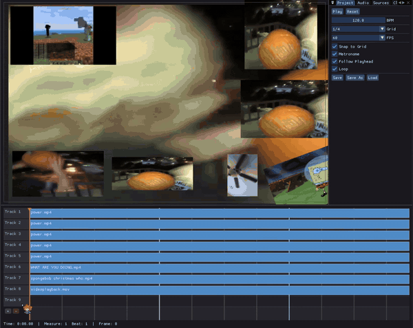

# furious



## What on earth is this?
**furious** is a specialized video editor and effects engine for creating YTPMVs/otomads and other music-focused content. It's basically a video editor, but the entire project is based on a BPM similar to a DAW. Doing this allows for easily syncing clips up to supporting audio and music. You no longer
have to worry about timing or any other nonsense like that.

### Custom video engine
furious uses a custom video engine built on FFmpeg decoding libraries. The goal is for playback
to be as uninterrupted and smooth as possible, while being able to handle a bunch of sources on screen at once. 

### Lua scripting
furious comes with an effects engine, with **Lua scripting support!** All the clip effects are loaded from the effect scripts folder at runtime. Right now Lua is used mainly for effects, but I eventually
want to let it do **anything** in the application.

### Development Warning
furious is in **very early development.** There are a lot of issues that I'm aware of, and a ton more that I'm not aware of. A lot of things may need to be reworked or changed completely. The current state of FURIOUS is purely a proof of concept and not intended to be a final product.

## Building
```bash
mkdir build
cd build
cmake ..
make
```

## Roadmap
Here are some things I'm planning to add, or are still in the cooker:
- Timeline rendering/export
- Timeline envelope automation
- More more and more effects
- Fully featured source library/clips/timeline functionality, like what you'd expect from modern editing software
- Media Proxies
- Testing and functionality on more gpus, more video codecs, and more operating systems
- Vulkan backend

# License
MIT